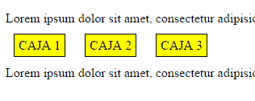
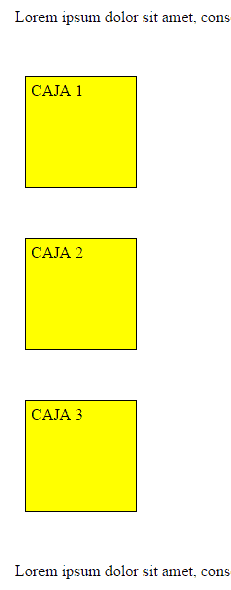
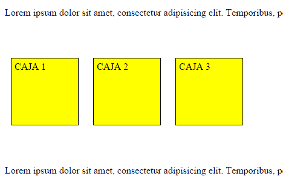
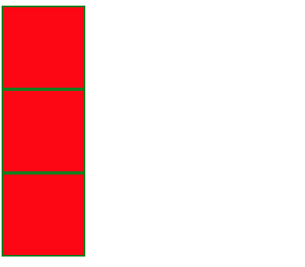
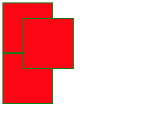
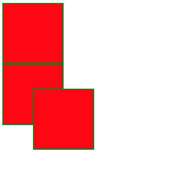
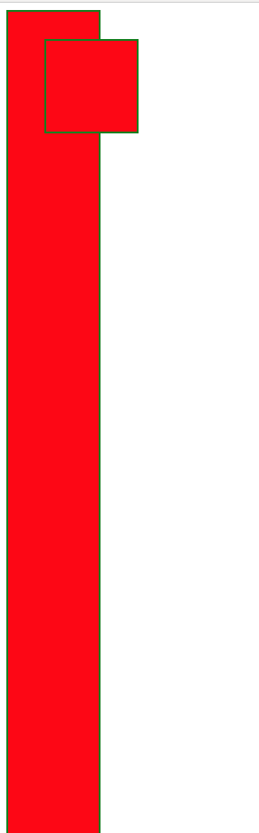
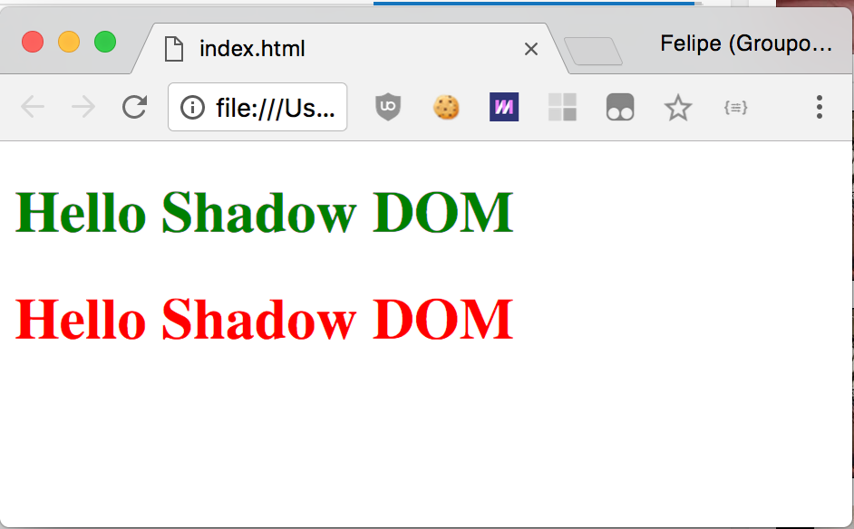
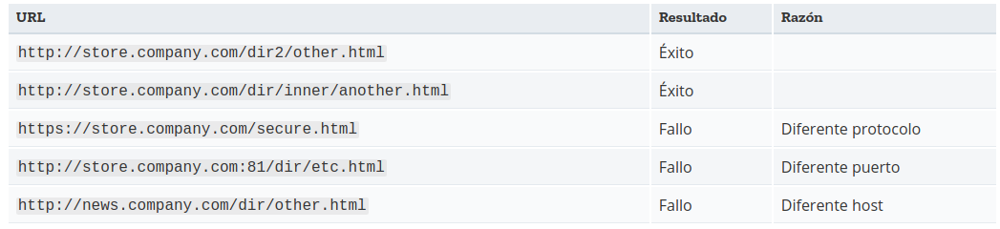

## Closures
```javascript
function start() {
    const name = "Mozilla"; // 'nombre' es una variable local creada por la función 'inicia'
    function showName() { // 'muestraNombre' es una función interna (un closure)
      alert(name); // dentro de esta función usamos una variable declarada en la función padre
    }
    showName();
}
inicia();
```

## Prototype
```javascript
function Person (name, lastName) {
    this.name = name;
    this.lastName = lastName;
    if (name && lastName) {
        this.fullName = `${name} ${lastName}`;
    }
    this.hello = () => {
        if (this.fullName) {
            console.log(`Hello I'm ${this.fullName}`);
        }
    }
}

const pepito = new Person ('pepito', 'perez');
Person.prototype.upperCaseName = function name(params) {
    return this.fullName.toUpperCase();  
}
```
## Hoisting

```javascript
function nombreDelGato(nombre) {
    console.log("El nombre de mi gato es " + nombre);
}
  
nombreDelGato("Maurizzio");
```

> *El resultado del código es: "El nombre de mi gato es Maurizzio"*

```javascript
var x = 5;

(function () {
    console.log("x:", x); // no obtenemos '5' sino 'undefined'
    var x = 10;
    console.log("x:", x); // 10
}());
```

> *El ejemplo anterior se entiende implícitamente como:*

```javascript
var x = 5;

(function () {
    var x; // Se elevo la declaración
    console.log("x:", x); // undefined
    x = 10;
    console.log("x:", x); // 10
}());
```

JavaScript sólo utiliza el hoisting en declaraciones, no inicializaciones. Si está utilizando una variable que es declarada e inicializada después (está después en el código) de usarla, el valor será undefined.

```javascript
var x = 1; // Inicializa x
console.log(x + " " + y); // '1 undefined'
var y = 2; //Inicializa y
```

> *El ejemplo anterior se entiende implícitamente como:*

```javascript
var x = 1; // Inicializa x
var y;// Se elevo la declaración
console.log(x + " " + y); // '1 undefined' 
y = 2; //Inicializa y
```

# ES5

 - Added "strict mode".
 - Added JSON support. JSON.parse() y JSON.stringify()## indexOf
 - What is the index of the first element that equals value?
    ```javascript 
    Array.prototype.indexOf(value, fromIndex) 
    ```
 -  What is the index of the last element that equal value?
    ```javascript 
    Array.prototype.lastIndexOf(value, fromIndex)
    ```

## Filter

> *Devuelve respuesta donde la funcion sea true*

```javascript
const nums = [1,3,4,5,7,9,10,15];
const pairs = nums.filter((num, index, numsObj) => {
    return num % 2 === 0;
    // if (num %2 === 0) {
    //     return num;
    // }
});
```

## every

> *El método every() verifica si todos los elementos en el arreglo pasan la prueba implementada por la función dada.*

```javascript
var array1 = [1, 30, 39, 29, 10, 13];
array1.every(num => num < 40); //true
array1.every(num => num < 30); //false
```

## some

> *El método some() verifica si algún elemento de un array cumple con el test implementado por la función brindada.*
```javascript
var array1 = [1, 30, 39, 29, 10, 13];
array1.some(num => num > 30); //true
array1.some(num => num > 40); //false
```

## Map

> *El método map() crea un nuevo array con los resultados de la llamada a la función indicada aplicados a cada uno de sus elementos.*

```javascript
const nums = [1,4,5,6,7];
const squared = nums.map(num => Math.pow(num, 2));
```

## forEach

> *El método forEach() ejecuta la función indicada una vez por cada elemento del array.*

```javascript
const nums = [1,2,4,5,3];
nums.forEach((num, index, array) => {
    console.log(num, index, array);
})
```

## reduce

> *El método reduce() aplica una función a un acumulador y a cada valor de un array (de izquierda a derecha) para reducirlo a un único valor.*

```javascript
const chars = ["H","e","l","l","o"];
chars.join(""); //Hello
const word = chars.reduce((beforeReturn, currentValue, index, array) => {
    return beforeReturn + currentValue;
});
const word2 = chars.reduce((beforeReturn, currentValue) => beforeReturn + currentValue);

const nums = [1,2,3,4,5,6,7,8];
const add = nums.reduce((prev, current) => prev + current); //36

const nums2 = [1,2,3,4,5,6,7,8];
const add2 = nums2.reduce((prev, current) => prev + current ,4); //40, se agrega valor inicial de 4, en la primera iteracion prev=4
```

## New methods in Object

```javascript
const object = {a: 1, b: 2, c: 3, d: "a", e: {f:4, g:5}};

Object.keys(object) //["a", "b", "c", "d", "e"]

Object.getOwnPropertyNames(object); //["a", "b", "c", "d", "e"]
```
> *Returns an array of all properties*

```javascript
Object.getPrototypeOf(object);
```
> *Devuelve el prototipo (es decir, el valor de la propiedad interna [[Prototype]]) del objeto especificado.*

```javascript
Object.preventExtensions(object)
```
> *Prevents anyone from adding properties to the object, cannot be undone.*

```javascript
Object.seal(object)
```
> *Prevents anyone from changing, properties or descriptors of the object. The values can still be changed*

```javascript
Object.freeze(object)
```
> *Prevents any changes to the object.*

## apply, bind, call
```javascript
var name = "Global name";
var greet = function (textGreet, treatment) {
    textGreet = textGreet || "Hi ";
    treatment = treatment || "";
    console.log(textGreet + treatment + this.name);    
}
var person1 = {
    name: "juanito"
}

var person2 = {
    name: "pepito"
}

greet(); //Hi Global name
//call (es el metodo que se llama internamente cuando uno llama a una funcion)
greet.call(person1, "Hello ", "Sr."); //Hello Sr. juanito
greet.call(person2, "Hello ", "Sr."); //Hello Sr. pepito

// apply

greet.apply(person1, ["Hello ", "Sr."]); //Hello Sr.juanito
greet.apply(person2, ["Hello ", "Sr."]); //Hello Sr.pepito

// bind

var callback = greet.bind(person2, ["Hello ", "Sr."]);
setTimeout(callback, 100); //Hello Sr. pepito
setTimeout(greet, 100); //Hi Global name
/**/

const Jane = {
    name: 'Jane',
    lastName: 'Doe',
    car : {
        brand: 'Volvo'
    }
}

const John = {
    name: 'John',
    lastName: 'Doe',
    car : {
        brand: 'Tesla'
    }
}

function greet(secLastName) {
    console.log('this', this);
    console.log(`Hi ${this.name} ${this.lastName} ${secLastName}`);
    
}

const greet2 = (secLastName) => {
    console.log('this', this);
    console.log(`Hi ${this.name} ${this.lastName} ${secLastName}`);
    
}

greet(); // this Windows   Hi undefined undefined

const greetJohn = greet.bind(John, ['IV']); //Hi John Doe IV
console.log(greetJohn()); //this John

const cb = greet2.bind(John);
cb("Solo"); //Hi undefined undefined Solo
```

## trim
```javascript
const orig = ' foo ';
console.log(orig.trim());//'foo'
```


## strict mode
```javascript
"use strict";
```
El modo estricto de ECMAScript 5 es una forma de optar explicitamente por una variante restringida de JavaScript. El modo estricto no es sólo un subconjunto: intencionalmente tiene diferente semántica que código normal. Los navegadores que no soportan el modo estricto ejecutarán el código con un modo diferente de los que sí lo soportan, así que no hay que usar en el modo estricto sin hacer pruebas previas. Código en modo estrico y en no estricto pueden coexistir, de modo que código puede migrarse a modo estricto incrementalmente. El modo estricto hace varios cambios en la semántica normal de JavaScript. Primero, elimina algunos errores silenciosos de JavaScript haciendo que lancen excepciones. Segundo, corrige errores que hacen que sea difícil para los motores de JavaScript realizar optimizaciones: a veces, el código escrito en modo estricto puede correr más rápido que el que no es estricto. Tercero, el modo estricto prohibe cierta sintaxis que es probable que sea definida en futuras versiones de ECMAScript.


# ES6

## find
> *El método find() devuelve el valor del primer elemento del array que cumple la función de prueba proporcionada. En cualquier otro caso se devuelve undefined.*

```javascript
var array1 = [5, 12, 8, 130, 44];

var found = array1.find((element) => {
    return element > 10;
});

console.log(found);
// expected output: 12
```

## findIndex

> *El método findIndex() devuelve el índice del primer elemento de un array que cumpla con la función de prueba proporcionada. En caso contrario devuelve -1.*

```javascript
var array1 = [5, 12, 8, 130, 44];

function findFirstLargeNumber(element) {
  return element > 13;
}

console.log(array1.findIndex(findFirstLargeNumber));
// expected output: 3
```

## fill

> *El método fill() rellena todos los elementos de un arreglo desde el índice start hasta el índice end, con el valor estático de value.*

```javascript
var array1 = [1, 2, 3, 4];

// fill with 0 from position 2 until position 4
console.log(array1.fill(0, 2, 4));
// expected output: [1, 2, 0, 0]

// fill with 5 from position 1
console.log(array1.fill(5, 1));
// expected output: [1, 5, 5, 5]
```


## Templates strings
```javascript
const name = "Pepito";
const template = `Hi I'm ${pepito}`;
```

## Arrow functions
```javascript
const fun = () => {};
```

## Class
```javascript
class Person {
    constructor(name, lastName) {
        this.name = name;
        this.lastName = lastName;
    }

    fullName() {
        return `${this.name} ${this.lastName}`;
    }

    static hello() {
        console.log("Hello");        
    }

    get name() {
        return this._name;
    }

    set name(value) {
        if (value.length<4) throw Error;
        this._name = value;
    }
}

class Student extends Person {
    constructor(name, lastName, id) {
        super(name, lastName);
        this.id = id;
    }
}

const juanito = new Person("Juanito", "Juarez");
const pepito = new Student("Pepito", "Perez", "12345");
pepito.fullName(); //"Pepito Perez"
pepito.id; //"12345"
Person.hello(); // Hello
Student.hello(); // Hello
```

> *Una importante diferencia entre las declaraciones de funciones y las declaraciones de clases es que las declaraciones de funciones son izadas y las declaraciones de clases no lo son. En primer lugar necesitas declarar tu clase y luego acceder a ella, de otra modo el ejemplo de código siguiente arrojará un ReferenceError:*

```javascript
var p = new Poligono(); // ReferenceError

class Poligono {}

var Foo = class {}; // constructor property is optional
var Foo = class {}; // Re-declaration is allowed

typeof Foo; //returns "function"
typeof class {}; //returns "function"

Foo instanceof Object; // true
Foo instanceof Function; // true
class Foo {}; // Throws TypeError, doesn't allow re-declaration
```

```javascript
class Foo {};
class Foo {}; // Uncaught TypeError: Identifier 'Foo' has already been declared
```

```javascript
var Foo = class {};
class Foo {}; // Uncaught TypeError: Identifier 'Foo' has already been declared
```

## Let
> *La instrucción let declara una variable de alcance local con ámbito de bloque(block scope), la cual, opcionalmente, puede ser inicializada con algún valor.*
>*Let es block scoping y var function scoping*

```javascript
function init () {
    if (true) {
        let name = "Pepito";
    }
    console.log(name); //undefined
}

function init () {
    if (true) {
        var name = "Pepito";
    }
    console.log(name); //Pepito
}
```

## const
> *Las variables constantes presentan un ámbito de bloque(block scope) tal y como lo hacen las variables definidas usando la instrucción let, con la particularidad de que el valor de una constante no puede cambiarse a través de la reasignación. Las constantes no se pueden redeclarar.*

```javascript
const name = "Pepito";
name = "juanito"; //Error

const arr = [1,2,3];
arr.push(4); // [1,2,3,4]

const obj = {};
obj.var1 = 4; // {var1: 4}
```

## Map
> *El objeto Map almacena pares clave/valor. Cualquier valor (tanto objetos como valores primitivos) pueden ser usados como clave o valor.*

```javascript
const car = new Map();

car.set("brand", "VW");
car.set("color", "white");
car.set(1, 1);
car.set([2], [2]);

car.get("brand"); //Get
car.has("color"); //If exist
car.delete("brand"); //Delete
```

## Set

> *El objeto Set te permite almacenar valores únicos de cualquier tipo, incluso valores primitivos u objetos de referencia.*

```javascript
const set = new Set();
set.add("Dog");
set.add("Chicken");
set.add("Cow");
set //{"Dog", "Chicken", "Cow"}
set.add("Chicken");
set //{"Dog", "Chicken", "Cow"}
set.add(1);
set.add("1");
set //{"Dog", "Chicken", "Cow", 1, "1"}
set.has("Dog"); //If exist
set.size; //3
```
## Destructuring

```javascript
const animals = new Array("Dog", "Cat", "Rat");
const [dog, cat, rat] = animals;
const obj = {
    var1: 1,
    var2: 2
}
const {var1, var2} = obj;
```
## for of

> *La sentencia for...of crea un bucle que itera a través de los elementos de objetos iterables (incluyendo Array, Map, Set, el objeto arguments, etc.), ejecutando las sentencias de cada iteración con el valor del elemento que corresponda.*


```javascript
var frameworks = ["ember", "angular", "react", "vue"];

for(const framework of frameworks) {
    console.log(framework);
}
```

## Default params

> *Los parámetros por defecto de una función permiten que los parámetros formales de la función sean inicializados con valores por defecto si no se pasan valores o los valores pasados son undefined.*

```javascript
function person(name = "No name", age = 0) {
    console.log(`name: ${name}, age: ${age}`);
}
person();
person("pepito",12);
```
## Spread

> *El operador de propagación spread operator permite que una expresión sea expandida en situaciones donde se esperan múltiples argumentos (llamadas a funciones) o múltiples elementos (arrays literales).*

```javascript
function device(type, name, brand) {
    console.log(`type: ${type}, name: ${name}, brand: ${brand}`);
}
const cellphone = new Array("Cell", "mi note 4", "Xiaomi");
device(...cellphone);
```
## Rest

> *La sintaxis de los parámetros rest nos permiten representar un número indefinido de argumentos como un arreglo. El operador Rest es exactamente igual a la sintaxis del operador de propagación, y se utiliza para desestructurar arrays y objetos. En cierto modo, Rest es lo contrario de spread. Spread 'expande' un array en sus elementos, y Rest recoge múltiples elementos y los 'condensa' en uno solo.*

```javascript
function hardware(...params) {
    console.log(params);
}
hardware("RAM","HDD","Mother board");
const components = ["RAM","HDD","Mother board"];
hardware(...components); //Spread, rest
```

## String - new functions

```javascript
const char = "abc";
char.repeat(2); //abcabc
char.includes("a"); //true
char.startsWith("ab"); //true
char.endWith("bc"); //true
```

## Number - new functions

```javascript
console.log(Number.isNaN("1")); //false
console.log(Number.isNaN(1)); //false
console.log(Number.isNaN(0/0)); //true

console.log(Number.isFinite(1)); //true
console.log(Number.isFinite(Infinity)); //false

console.log(Number.isInteger(1)); //true
console.log(Number.isInteger("1")); //false
console.log(Number.isInteger(1.2)); //false
```

## Object assign

```javascript
const name = {name: "Pepito"};
const lastName = {lastName: "Perez"};
const age = {age: 43};
const result =  {};
Object.assign(result, name, lastName, age); //{name: "Pepito", lastName: "Perez", age: 43}
```

## Promises

> *El objeto Promise (Promesa) es usado para computaciones asíncronas. Una promesa representa un valor que puede estar disponible ahora, en el futuro, o nunca.*

```javascript
var promise = new Promise((resolve, reject) => {
    const random = parseInt(Math.random()*10);
    setTimeout(() => {
        if (random<5) {
            resolve(true);
        }
        reject(false);
    }, 100);
}).then((res)=>{
    console.log("res", res);
}).then((res)=>{
    console.log("here",res);
}).catch((err)=> {
    console.log("err", err);
});
```

## POO

**Clase abstracta:**  una clase que no se puede instanciar (crear un objeto de esa clase) pero si se pueden definir atributos e implementar métodos en ella para que sus clases hijas los puedan utilizar. 

**Interface:** es una clase abstracta pura en la que todos sus métodos son abstractos y por tanto no se pueden implementar en la clase Interface 

**Pilares POO** 
- *Abstracción:* Podríamos definir la abstracción como la "acción de aislar mentalmente o considerar por separado las cualidades de un objeto, considerar un objeto en su esencia". ¿Qué quiere decir esta definición? A través de la abstracción conseguimos extraer las cualidades principales sin detenernos en los detalles.
- *Encapsulamiento:* Significa reunir todos los elementos que pueden considerarse pertenecientes a una misma entidad, al mismo nivel de abstracción. Esto permite aumentar la cohesión (diseño estructurado) de los componentes del sistema. Algunos autores confunden este concepto con el principio de ocultación, principalmente porque se suelen emplear conjuntamente.
- *Polimorfismo:* Esta característica permite definir distintos comportamientos para un método dependiendo de la clase sobre la que se realize la implementación. En todo momento tenemos un único medio de acceso, sin embargo se podrá acceder a métodos distintos.
- *Herencia:* Las clases no se encuentran aisladas, sino que se relacionan entre sí, formando una jerarquía de clasificación. Los objetos heredan las propiedades y el comportamiento de todas las clases a las que pertenecen. La herencia organiza y facilita el polimorfismo y el encapsulamiento, permitiendo a los objetos ser definidos y creados como tipos especializados de objetos preexistentes.


## REST
Buscando una definición sencilla, REST es cualquier interfaz entre sistemas que use HTTP para obtener datos o generar operaciones sobre esos datos en todos los formatos posibles, como XML y JSON.  

Es un estilo de arquitectura software para sistemas hipermedia distribuidos como la World Wide Web.

En la actualidad se usa en el sentido más amplio para describir cualquier interfaz entre sistemas que utilice directamente HTTP para obtener datos o indicar la ejecución de operaciones sobre los datos, en cualquier formato (XML, JSON, etc) sin las abstracciones adicionales de los protocolos basados en patrones de intercambio de mensajes, como por ejemplo SOAP. 

Las operaciones más importantes relacionadas con los datos en cualquier sistema REST y la especificación HTTP son cuatro: POST (crear), GET (leer y consultar), PUT (editar) y DELETE (eliminar). 

Los objetos en REST siempre se manipulan a partir de la URI. Es la URI y ningún otro elemento el identificador único de cada recurso de ese sistema REST. La URI nos facilita acceder a la información para su modificación o borrado, o, por ejemplo, para compartir su ubicación exacta con terceros.  

Rest son los principios de arquitectura de software Restful son los servicios web que siguem esos principios 

Todo es un recurso, identificador unico (URI), usa metodos HTTP estandar, pueden tener multiples representaciones (XML, JSON, ...), Comunicacion sin estado 


## Errores http
### 1xx: Respuestas informativas

### 2xx: Peticiones correctas
-200 OK Respuesta estándar para peticiones correctas.
-201 Created La petición ha sido completada y ha resultado en la creación de un nuevo recurso. 
-204 No Content La petición se ha completado con éxito pero su respuesta no tiene ningún contenido (la respuesta sí que puede incluir información en sus cabeceras HTTP).2​


### 3xx: Redirecciones
 300 Multiple Choices Indica opciones múltiples para el URI que el cliente podría seguir. Esto podría ser utilizado, por ejemplo, para presentar distintas opciones de formato para video, listar archivos con distintas extensiones o word sense disambiguation. 

### 4xx Errores del cliente
-400 Bad Request La solicitud contiene sintaxis errónea y no debería repetirse. 
-401 Unauthorized Similar al 403 Forbidden, pero específicamente para su uso cuando la 
autentificación es posible pero ha fallado o aún no ha sido provista. 
Vea autenticación HTTP básica y Digest access authentication. 
-403 Forbidden La solicitud fue legal, pero el servidor rehúsa responderla dado que el cliente no tiene los privilegios para hacerla. En contraste a una respuesta 401 No autorizado, la autenticación no haría la diferencia. 
-404 Not Found Recurso no encontrado. Se utiliza cuando el servidor web no encuentra la página o recurso solicitado. 
-405 Method Not Allowed Una petición fue hecha a una URI utilizando un método de solicitud no soportado por dicha URI; por ejemplo, cuando se utiliza GET en un formulario que requiere que los datos sean presentados vía POST, o utilizando PUT en un recurso de solo lectura. 

### 5xx Errores de servidor
500 Internal Server Error Es un código comúnmente emitido por aplicaciones empotradas en servidores web, mismas que generan contenido dinámicamente, por ejemplo aplicaciones montadas en IIS o Tomcat, cuando se encuentran con situaciones de error ajenas a la naturaleza del servidor web. 


## Graceful degradation
Un sitio web diseñado para que degrade gradualmente está pensado para que se vea primero correctamente en los navegadores  modernos. Para que se puedan acceder en los navegadores más antiguos, y menos ricos en características deben degradar, de forma a funcionar, pero con menos características. La página empieza a degradar cuando, a través de detección user-agent, o utilizando la herramienta Modernizr como biblioteca de detección  de características para HTML5/CSS3 le vamos substituyendo o añadiendo soluciones al conflicto de forma a tener un resultado que se pueda presentar a cliente.

## Progressive Enhancement
El Progressive Enhancement dice que los sitios webs no tienen que tener la misma apariencia en todos los navegadores, pero aprovechar las capacidades del navegador para que el mayor número posible de usuarios tenga la mejor experiencia posible. La Mejora progresiva seria lo inverso a la Degradación gradual; empezar por lo básico (HTML + CSS) e ir evolucionando “progresivamente”, utilizando las mismas herramientas de user-agent y detección de características. 

## Singleton
"Singleton", que en ingeniería del software es un patrón diseñado para limitar la creación de objetos pertenecientes a una clase. El objetivo de este patrón es el de garantizar que una clase solo tenga una instancia (o ejemplar) y proporcionar un punto de acceso global a ella. Esta patrón; por ejemplo, suele ser utilizado para las conexiones a bases de datos. Este patrón se implementa haciendo privado el constructor de la clase y creando (en la propia clase) un método que crea una instancia del objeto si este no existe.

## Pruebas unitarias
Una prueba unitaria es una forma de comprobar el correcto funcionamiento de una unidad de código. Por ejemplo en diseño estructurado o en diseño funcional una función o un procedimiento, en diseño orientado a objetos una clase. Esto sirve para asegurar que cada unidad funcione correctamente y eficientemente por separado. Además de verificar que el código hace lo que tiene que hacer, verificamos que sea correcto el nombre, los nombres y tipos de los parámetros, el tipo de lo que se devuelve, que si el estado inicial es válido entonces el estado final es válido

## Pruebas funcionales
En este caso, el objetivo de las pruebas funcionales es comprobar que el software que se ha creado cumple con la función para la que se había pensado. En este tipo de pruebas lo que miramos, lo que nos importan, son las entradas y salidas al software. Es decir, si ante una serie de entradas el software devuelve los resultados que nosotros esperábamos. Aquí solo observamos que se cumpla la funcionalidad, no comprobamos que el software esté bien hecho, no miramos el diseño del software. Estudiamos el software desde la perspectiva del cliente, no del desarrollador.

## Modelo de Caja de CSS

Al diseñar un documento, el motor de representación del navegador representa cada elemento como un cuadro rectangular según el estándar modelo de caja de CSS. CSS determina el tamaño, la posición y las propiedades (color, fondo, tamaño del borde, etc.) de estos cuadros.

Cada caja se compone de cuatro partes (o áreas), definidas por sus respectivos límites: el límite del contenido, el límite del relleno (padding), el límite del borde y el límite del margen.


El área de contenido (content area), delimitada por el límite del contenido, contiene el contenido "real" del elemento, como lo puede ser texto, imagen o un reproductor de video. Sus dimensiones son el ancho del contenido (o el ancho de la caja de contenido) y la altura del contenido (o la altura de la caja de contenido). A menudo tiene un color de fondo o una imagen de fondo.

Si la propiedad `box-sizing` está configurada en `content-box` (default), el tamaño del área de contenido se puede definir explícitamente con las propiedades de width, min-width, max-width, height, min-height y max-height.

El área de relleno (padding), delimitada por el límite del relleno, extiende el área de contenido para incluir el relleno del elemento. Sus dimensiones son el ancho de la caja de relleno y la altura de la caja de relleno. Cuando el área de contenido tiene un fondo, se extiende dentro del relleno.

El espesor del relleno está determinado por las propiedades `padding-top`, `padding-right`, `padding-bottom`, `padding-left`, y la propiedad abreviada `padding`.

El área del borde, delimitada por el límite del borde, extiende el área de relleno para incluir los bordes del elemento. Sus dimensiones son el ancho de la caja del borde y la altura de la caja del borde.

El espesor de los bordes está determinado por las propiedades `border-width` y la propiedad abreviada `border`. Si la propiedad `box-sizing` se establece en `border-box`, el tamaño del área del borde se puede definir explícitamente con las propiedades `width`, `min-width`, `max-width`, `height`, `min-height`, y `max-height`.

El área del margen, delimitada por el límite del margen, extiende el área del borde para incluir un área vacía utilizada para separar el elemento de sus vecinos. Sus dimensiones son el ancho de la caja del margen y la altura de la caja del margen.

El tamaño del área del margen está determinado por las propiedades `margin-top`, `margin-right`, `margin-bottom`, `margin-left`, y la propiedad abreviada `margin`. Cuando se produce el colapso del margen, el área del margen no está claramente definida ya que los márgenes se comparten entre las cajas.

Finalmente, ten en cuenta que para elementos en línea no reemplazados, la cantidad de espacio ocupado (la contribución a la altura de la línea) está determinada por la propiedad `line-height`, aunque los bordes y el relleno todavía se muestran alrededor del contenido.

## Programación orientada a componentes

Extensión natural de la programación orientada a objetos (POO) en los sistemas de aplicación abiertos, que tiene como propósito contrarrestar las limitaciones de esta, como la falta de una unidad concreta de composición independiente en las aplicaciones, y la definición de interfaces a bajo nivel, que dificultan la reutilización comercial de objetos. Se considera que el nivel de abstracción de los componentes es más alto que el de los objetos y por lo tanto no comparten un estado y se comunican intercambiando mensajes que contienen datos.

Un componente de software es un elemento de un sistema que ofrece un servicio predefinido, y es capaz de comunicarse con otros componentes.  Un componente es un objeto escrito de acuerdo a unas especificaciones. No importa qué especificación sea ésta, siempre y cuando el objeto se adhiera a la especificación. Solo cumpliendo correctamente con esa especificación es que el objeto se convierte en componente y adquiere características como reusabilidad. Cuando se necesita el acceso a un componente o cuando este debe ser compartido entre distintas redes, se recurre a procesos como la serialización para entregar el componente a su destino. La capacidad de ser reutilizado (reusability), es una característica importante de los componentes de software de alta calidad. Un componente debe ser diseñado e implementado de tal forma que pueda ser reutilizado en muchos programas diferentes.

Los principios más importantes de la programación orientada a componentes son:

- La separación de la interfaz de la implementación.
- La compatibilidad binaria.
- La independencia del lenguaje.
- La transparencia en la localización.
- La gestión de la concurrencia.
- El control de versiones.
- La seguridad basada en componentes.


## Protocolo sin estado

Es un protocolo de comunicaciones que trata cada petición como una transacción independiente que no tiene relación con cualquier solicitud anterior, de modo que la comunicación se compone de pares independientes de solicitud y respuesta. Un protocolo sin estado no requiere que el servidor retenga información de la sesión o de estado acerca de cada socio de las comunicaciones durante la duración de múltiples peticiones. En contraste, un protocolo que requiere el mantenimiento del estado interno en el servidor se conoce como un protocolo con estado. Ejemplos de protocolos sin estado son el Internet Protocol (IP), que es la base para Internet, y el Hypertext Transfer Protocol (HTTP), que es la base de la comunicación de datos para la World Wide Web.

El diseño sin estado simplifica el diseño del servidor porque no hay necesidad de asignar dinámicamente almacenamiento para tratar las conversaciones en curso. Si un cliente desaparece en medio de la transacción, ninguna parte del sistema tiene que ser responsable de limpiar el estado actual del servidor.

Una desventaja de los protocolos sin estado es que puede ser necesario incluir información adicional en cada petición, y esta información adicional necesitará ser interpretada por el servidor.

## Stateful

When we talk about computer systems, a “state” is simply the condition or quality of an entity at an instant in time, and to be stateful is to rely on these moments in time and to change the output given the determined inputs and state.

When an application operates in a stateful mode, the server keeps track of who users are and what they do from one screen to the next. Preserving the state of users’ actions is fundamental to having a meaningful, continuous session. It typically begins with a login with user ID and password, establishing a beginning state to the session. As a user navigates through the site, the state may change. The server maintains the state of the user’s information throughout the session until logout.


# Preguntas frecuentes entrevista tecnica frontend

## ¿Qué imprime el siguiente código?

```javascript
setTimeout(function() { 
    console.log('AAA');
}, 0);

for (i = 0; i < 1000; i++) {
    console.log('BBB'); 
}
for (i = 0; i < 1000; i++) {
    console.log('CCC'); 
}
//BBB
//CCC
//AAA
```
> *JavaScript is single-threaded. Asynchronous callbacks are assigned to a message placed in a message queue.*
> *When no code is currently executing, the event loop polls the message queue, requesting the next message in line to be processed (executed).*
> *setTimeout adds a message (with the callback provided) to the end of this queue after the specified delay has elapsed.*

## Describa los pseudo-elementos y discuta sus usos.

Una **pseudoclase** CSS es una palabra clave que se añade a los selectores y que especifica un estado especial del elemento seleccionado. Por ejemplo,  :hover aplicará un estilo cuando el usuario haga hover sobre el elemento especificado por el selector.
Al igual que las pseudo-classes, los **pseudo-elementos** se añaden a los selectores, pero en cambio, no describen un estado especial sino que, permiten añadir estilos a una parte concreta del documento. Por ejemplo, el pseudoelemento ::first-line selecciona solo la primera línea del elemento especificado por el selector.

## ¿Qué hace un `doctype` (`<!DOCTYPE html>`)?
Es una declaración al comienzo de un documento HTML (previo al tag `<html>`). Consiste en una instrucción que le deja saber al navegador en que versión de HTML está el documento para interpretarlo correctamente.
Definir `<!DOCTYPE html>` le dice al navegador que tiene que parsear el HTML basándose en el estandar HTML5.
En el caso de navegadores más viejos, interpretarán el HTML en un modo "compatible con HTML5" pero ignorarán las funcionalidades que no soporten.
`<!DOCTYPE html>` es mucho más simple que las definiciones de doctype anteriores, como por ejemplo:
`<!DOCTYPE HTML PUBLIC "-//W3C//DTD HTML 4.01//EN" "http://www.w3.org/TR/html4/strict.dtd">`

## ¿Cuál es la diferencia entre inline y inline-block?

- inline: Muestra en la misma línea (respetando el flujo) todos los elementos y no acepta las propiedades width, height ni margenes verticales.
- block: Muestra los elementos en líneas independientes y acepta las propiedades width, height y margenes verticales.
- inline-block: Su comportamiento es una mezcla entre los dos anteriores, se muestran en la misma línea (respetando el flujo) todos los elementos y además, acepta las propiedades width, height y margenes verticales.

ejms:
```css
.caja {
    background-color: yellow;
    border: 1px solid black;
    width: 100px;
    height: 100px;
    padding: 5px;
    margin: 50px 10px;
}
```
```html
<p>Lorem ipsum dolor...</p>
<span class="caja">CAJA 1</span> <!-- display: inline -->
<span class="caja">CAJA 2</span>
<span class="caja">CAJA 3</span> 
```


> *Como vemos las cajas tienen un estilo in-line porque son spans, se alinean unas a continuación de otras, pero no se respetan los anchos, los altos ni los márgenes verticales de los elementos.*

Siguiendo con el mismo ejemplo anterior, si simplemente sustituimos los `<span>` por elementos `<div>`, ahora las cajas son elementos de bloque, y se renderizarán de la siguiente manera:



El tercer valor de la lista anterior es muy interesante ya que permite obtener un comportamiento intermedio entre los otros dos. Los elementos inline-block fluyen con el texto y demás elementos como si fueran elementos en-línea y además respetan el ancho, el alto y los márgenes verticales.

Así, si por ejemplo redefinimos la etiqueta `<span>` de esta manera (display: inline-block):



## ¿Cuál es la diferencia entre las posiciones relative, fixed, absolute y static para un elemento dado?

- **static:** Es el valor que toma un elemento por defecto para posicionarse. Con este valor, el elemento respetará el flujo normal de la página, es decir, se posicionará en el lugar que le corresponde y no tendrá en cuenta los valores para las propiedades top, left, right y bottom.
```css
.rojo{
    height: 100px;
    width: 100px;
    background-color: red;
    border: 2px green solid;
}
#movido{
    left: 100px;
}
```
```html
<div class="rojo"></div>
<div id="movido" class="rojo"></div>
<div class="rojo"></div>
```


- **relative:** Mediante este valor podemos posicionar un elemento respecto al flujo normal de la página. Se podría decir que estamos posicionando un elemento tomando como referencia el flujo normal (la posición por defecto) de dicho elemento. Podremos usar top, left, right y bottom para posicionar nuestro elemento tomando como referencia la posición por defecto del elemento. En este caso, voy a aplicarle la propiedad left: 100px del ejemplo anterior y el div movido se desplazará 100 pixeles a la derecha desde su posición por defecto.
```css
.rojo{
  height: 100px;
  width: 100px;
  background-color: red;
  border: 2px green solid;
}
#movido{
  position: relative;
  left: 100px;
}
```
```html
<div class="rojo"></div>
<div id="movido" class="rojo"></div>
<div class="rojo"></div>
```


- **absolute:** Este valor también aceptará los valores top, left, right y bottom. El elemento con position: absolute no estará dentro del flujo normal de la página y tomará como referencia la ventana del navegador o el elemento posicionado (que tenga cualquier valor de position excepto static) más cercano si es padre del elemento que queremos posicionar.

    A continuación te muestro un ejemplo de cada uno:

    Ejemplo tomando como referencia la ventana del navegador

    En este caso voy a tomar como referencia la ventana del navegador y desplazar el div movido 40 pixeles hacia abajo y 50 pixeles a la derecha respecto a esta.

    Puedes observar que el div movido, al no estar dentro del flujo normal de la página, no afecta al flujo normal del resto de elementos y por lo tanto los otros dos elementos se posicionan juntos (sin respetar el espacio que deja el div movido en el ejemplo anterior, en el cual sí que está en el flujo normal de la página).

```css
.rojo{
  height: 100px;
  width: 100px;
  background-color: red;
  border: 2px green solid;
}
#movido{
  position: absolute;
  top: 40px;
  left: 50px;
}
```
```html
<div class="rojo"></div>
<div id="movido" class="rojo"></div>
<div class="rojo"></div>
```


    Ejemplo tomando como referencia el elemento padre con position:relative más cercano

    En este caso, he utilizado el mismo CSS para el div con id movido que en el ejemplo anterior para que se viera que en este caso el div movido toma como referencia el elemento padre con position: relative y no la ventana del navegador (40 pixeles hacia abajo y 50 pixeles hacia la derecha respecto del elemento padre).

```css
.rojo{
  height: 100px;
  width: 100px;
  background-color: red;
  border: 2px green solid;
}
#relativo{
  position: relative;
}
#movido{
  position: absolute;
  top: 40px;
  left: 50px;
}
```
```html
<div class="rojo"></div>
<div id="relativo" class="rojo">
  <div id="movido" class="rojo"></div>
</div>
```


- **fixed:** Los elementos a los cuales se les posiciona con position: fixed también están fuera del flujo normal de la página. Sin embargo, no se debe de confundir con los elementos que están posicionados con position: absolute.

    A diferencia de estos últimos, los elementos con position: fixed toman como referencia la ventana del navegador y no respetan el tener un contenedor padre que esté posicionado. Además, al hacer scroll en la página, el elemento que esté posicionado como position: fixed seguirá en la misma posición respecto a la ventana del navegador aunque el scroll haya desplazado la página hacia abajo.

    Como una imagen vale más que mil palabras y tomando como referencia el último ejemplo del apartado position: absolute:
```css
.rojo{
    height: 100px;
    width: 100px;
    background-color: red;
    border: 2px green solid;
}
#primerDiv{
    height: 2000px
}
#relativo{
    position: relative;
}
#movido{
    position: fixed;
    top: 40px;
    left: 50px;
}
```
```html
<div id="primerDiv" class="rojo"></div>
<div id="relativo" class="rojo">
    <div id="movido" class="rojo"></div>
</div>
```



    Como puedes observar, el div movido está posicionado con position: fixed respecto a la ventana del navegador independientemente de que esté contenido en un elemento con position: relative o de que se realice un scroll sobre la página.

## ¿Hay alguna razón por la cual preferirías usar translate() en vez de el posicionamiento absoluto? ¿Alguna razón para hacer lo contrario?

It is possible to achieve better performances with transform rather than position.
Currently most browsers only use GPU acceleration when they have a strong indication that an HTML element would benefit from it. The strongest indication is that a 3D transformation was applied to it. Now you might not really want to apply a 3D transformation, but still gain the benefits from GPU acceleration - no problem. Simply apply the identity transformation:
`-webkit-transform: translateZ(0);`
reason behind this, is that you delegate some of the work that the CPU has to do, to the GPU, however be considerate as this won't necessarily be always worth, especially on a mobile device like the iPad, that is your environment:
Please be warned that this applying this transformation does not guarantee to help your performance. It might simply crank up your GPU, use up more battery but deliver the same performance as before. So be careful with this technique and only use it if you experience a true performance win.

## Explique "event delegation".

Event delegation allows you to avoid adding event listeners to specific nodes;  instead, the event listener is added to one parent.  That event listener analyzes bubbled events to find a match on child elements.  The base concept is fairly simple but many people don't understand just how event delegation works.  Let me explain the how event delegation works and provide pure JavaScript example of basic event delegation.
```html
<ul id="nav">
    <li id="post-1">Item 1</li>
    <li id="post-2">Item 2</li>
    <li id="post-3">Item 3</li>
    <li id="post-4">Item 4</li>
    <li id="post-5">Item 5</li>
    <li id="post-6">Item 6</li>
</ul>
```
```javascript
document.getElementById("nav").addEventListener("click", function(e) {
    // e.target is the clicked element!
    // If it was a list item
    if(e.target && e.target.nodeName == "LI") {
        // List item found!  Output the ID!
        console.log("List item ", e.target.id.replace("post-", ""), " was clicked!");
    }
});
```

## ¿Qué es una IIFE?

## ¿Qué nuevos elementos componen "HTML5"?
- Semántica - Un marcado de texto (Text Markup) más semántico. Lo que agrega mejor accesibilidad, más herramientas para la descripción de el contenido Web y mayor facilidad para el SEO.
`<footer>`, `<canvas>`, `<article>`, `<main>`, `<nav>`, `<aside>`, `<dialog>`, `<section>`, - Etc...
- Nuevos elementos de form:
`<datalist>`, `<keygen>`, `<output>`
- Conectividad (Diferentes métodos de comunicación)
WebSockets, WebRTC, Eventos del Servidor (server-sent events)
- Offline Web
Caché de aplicación, Web Workers, IndexedDB, Uso de archivos offline (File API / FileReader), Detección de la conectividad (navigator.onLine)
- Multimedia e interacción
`<Audio>` y `<Video>`
- Trabajos gráficos
WebGL, Canvas, SVG
- JavaScript/Integraciónes
Web Workers, History API, DragAndDrop, RequestAnimationFrame, FullScreenAPI, PointerLock, 
- Acceso al dispositivo
Cámara, Eventos touch, Orientación del dispositivo, Geolocalización, Web Bluetooth, - WebVR
- CSS3

## ¿Cuál es la diferencia entre normalizar y anular(reset) el CSS?, ¿cuál usarías y por qué?
- CSS Reset hace, es redefinir toda una serie de objetos HTML (div, body, strong, etc.) para que tengan el mismo aspecto en todos los navegadores, dándoles un valor para que el navegador no utilice el valor que a cada navegador le venga más en gana.
- Pues la mayor diferencia es que un CSS reset –como su nombre indica- hace un reinicio completo del CSS, vamos que lo deja a 0. Puede que eso sea lo que queremos, pero por desgracia perderemos otras cosas útiles que hacen los navegadores web. Y tendremos que especificar muchas más cosas en nuestro CSS de las que especificaríamos normalmente.
Por el contrario, normalize.css lo que hace es normalizar –con ese nombre quien lo diría- la forma en que los navegadores muestran un contenido. Es decir, no eliminan el estilo por defecto que los navegadores dan a los elementos HTML, sino que hace que todos los navegadores utilicen el mismo estilo por defecto.

## ¿Qué sucede al usar `* {box-sizing: border-box;}` ¿Qué desventajas supone su uso?

La propiedad box-sizing se usa para modificar las propiedades por defecto del CSS box model que calculan el alto y el ancho de los elementos . De hecho es posible usarla para emular el comportamiento de los navegadores que no soportan las especificaciónes del CSS box model.

- *border-box*
El width y el height incluyen el padding y el border, pero no el margin. Volviendo al primer ejemplo, si usaramos border-box en el elemento .box {width: 300px; border: 10px solid black; padding: 10px; -moz-box-sizing: border-box; box-sizing: border-box; } tendrá un width de 300px después de ser interpretado por el navegador.

- *padding-box*
En este caso las propiedades width y height incluyen en padding pero no incluyen el border y el margin.

- *content-box (default)*
Este es el estilo por defecto especificado en el estándar de CSS . Las propiedades width y height son las medidas incluídas solo en el contenido, pero no incluyen el padding, el border o el margin. Por ejemplo, el elemento .box {width: 300px; border: 10px solid black; padding: 10px; } cuando sea interpretado por el navegador tendrá un width de 340px (resultado de la suma del border, el padding y el width).

## ¿Para qué sirven los atributos `data-`?
Es un atributo de HTML, un estándar que permite adjuntar o guardar información extra en un elemento. Estos atributos personalizados nos permiten añadir datos en el HTML sin afectar a su visualización y sin salirnos del propio lenguaje HTML. Posteriormente podemos usar esta información para aplicar estilos CSS (o mostrar esta información con CSS) y podemos tratarla con JavaScript.
```html
  <div
    id="unDivCualquiera"
    data-usuario="fforres"
    data-usuario-correo="felipe.torressepulveda@gmail.com" >
```
El acceso está estandarizado, puedes acceder a la data de la siguiente manera:
```javascript
const article = document.getElementById('unDivCualquiera');
article.dataset.usuario // "fforres"
article.dataset.usuarioCorreo // "felipe.torressepulveda@gmail.com"
```

## ¿Cuál es la diferencia entre una `cookie`, `localStorage` y una `sessionStorage`?
**Cookie:** Pequeño set de información enviada por un sitio Web y almacenado en el navegador de un usuario. Se guarda en el disco, por lo que esta data es persistente. Es posible guardar y recuperar la data usando JS de la siguiente manera:

```javascript
document.cookie = "username=fforres";
/*O darle una fecha de expiración*/
document.cookie = "username=fforres; expires=Thu, 19 Feb 2019 11:59:59 UTC";
const cookie = document.cookie;
```

Cada llamada a `document.cookie = "(...)"` crea una nueva cookie. Las cookies se guardan en texto plano. Pueden guardar poca data (4KB). Son enviadas en cada request.

**sessionStorage:** La propiedad `sessionStorage` permite acceder al objeto local `Storage` pero solo durante la sesión del usuario. Una sesión dura hasta que el navegador es cerrado. La data sobrevive a recargas de página. Una nueva "tab" o "ventana" genera una nueva sesión.

```javascript
sessionStorage.setItem('usuario', 'fforres');
/* guarda en la llave "usuario" el valor "fforres" */

const usr = sessionStorage.getItem('usuario');  // usr retorna "fforres"

sessionStorage.removeItem('usuario') // remueve la data guardada en esa llave

sessionStorage.clear() //remueve toda la data de la sesión.
```
aprox. 5MB de storage por dominio

**localStorage:** La propiedad `localStorage` permite acceder al objeto local `Storage`. La data no tiene una fecha de expiración y es accesible desde múltiples ventanas o tabs del mismo dominio y navegador. 
```javascript
const miStorage = localStorage;
/* myStorage es ahora un objecto Storage */

miStorage.setItem('usuario', 'fforres');
/* guarda en la llave "usuario" el valor "fforres" */

miStorage.usuario  // retorna "fforres"
```

aprox. 5MB de storage por dominio.

Las propiedades del `localStorage` solo pueden ser accedidas por páginas con el mismo dominio que la página que definió (set o *seteó*) las propiedades. Por ejemplo, si una página como ejemplo.com *setea* algo en el `localStorage` puede ser accedida por ejemplo.com/xxxxx, ejemplo.com/yyyyy, ejemplo.com/xxxxx/zzzzz y así.

**Como nota muy importante:** los datos guardados en `localStorage` y en `sessionStorage` son **específicos al protocolo de la página**. No es lo mismo http://ejemplo.com que https://ejemplo.com, por lo que los datos a los que acceden/escriben son distintos.


## ¿Qué diferencias existen entre `<script>`, `<script async>` y `<script defer>`?
**script:** Descarga el archivo y lo ejecuta, pero tanto la descarga como la ejecución se desarrollan secuencialmente y por lo mismo detienen el parseo del HTML.

**script async:** Descarga el archivo paralelamente a la descarga/parseo del resto del documento/assets, pero al momento de ejecutarlo detiene el parseo del HTML.

**script defer:** Descarga el archivo paralelamente a la descarga/parseo del resto del documento/assets, pero espera hasta que todo el HTML esté parseado antes de ejecutar el script.


## ¿Puedo poner un tag `<link>` dentro del body? ¿Por qué no es recomendado?
Sí. No es recomendado, aunque posible. Ejemplo de un proceso de descarga de un archivo HTML, un archivo CSS, una imagen y un archivo JS:
- Descarga el "HTML".
- Se parsea el HTML y ve que hay un archivo CSS, un archivo JS y una imagen.
- Se inicia la descarga de la imagen.
- El navegador decide que no puede mostrar la página sin antes descargar el CSS y JS.
  - Esta decisión se toma porque ambos archivos podrían alterar la visualización del DOM causando Reflow o Repaint si el CSS tuviese un `display: none` o el JS un `Node.remove()`, por ejemplo.
- Descarga por orden de aparición (CSS o JS).
- Al descargar el CSS, lo lee, parsea, y se asegura que no llame nada más (un `@import` o `background:url('./imagen.jpg')`).
- Al descargar el JS, lo lee, interpreta y ejecuta.
- El navegador decide que ahora sí puede mostrar el DOM, por lo que empieza a pintar y estilar el DOM.

En este ejemplo, en el caso de tener un segundo `<link />` dentro del body, el proceso se ejecuta normalmente hasta que se parsea el DOM, dentro del body se encuentra con el `<link />`, se detiene el parseo y pintado del DOM para descargar y parsear el CSS.

Luego de eso vuelve a resumir el trabajo con el DOM y aplicar estilos de ser necesario.

## ¿Dónde es recomendado poner los tag `<script/>`? ¿Después o antes del body? ¿Existen excepciones?
Depende mucho del contenido y acciones que ejecutarán dichos scripts. En antaño los `<script/>` se colocaban posterior al body para priorizar el mostrar la estructura del contenido (HTML), estilarlo (CSS) y después agregar la interactividad con los scripts. Pero actualmente existen los atributos `async` o `defer` que nos ayudan a definir descargas, parseos y ejecución diferidos.

## ¿Qué es el Rendering Progresivo?
Un conjunto de técnicas y decisiones tomadas y aplicadas a fin de priorizar qué contenido o elemento se debería cargar primero (el contenido de una noticia, el landing en un sitio Web) y despriorizar la carga de otras secciones (footer, banners, side-menus, etc).

## ¿Qué son y cómo afectan al performance el `Reflow` y `Paint`/`RePaint` ?
**RePaint** es el nombre que se le da al proceso que ejecuta el navegador cuando realiza cambios visuales a un elemento, pero no cambia su `layout` (color de fondo, visibilidad, outline).

**Reflow** es el proceso que ejecuta el navegador cuando los cambios que realiza a un elemento, cambian su layout (posicion, tamaño, etc) que obligan a recalcular y posiblemente reposicionar otros elementos en el documento.

Ambos procesos son críticos a la hora de analizar y optimizar la performance, donde `ReFlow` afecta de manera mucho mayor.

Al mover un elemento que cause `ReFlow`, es necesario recalcular **todos** los otros elementos del DOM que podrían verse afectados por este cambio.

`RePaint` necesita verificar la visibilidad de todos los otros nodos y como estos afectan a la visibilidad de el/los nodos iniciales.
Ejemplo:

El cambiar el color de fondo de un `<div id="a" />` sobre el que hay un `<div id="b">` con una opacidad `0.5`, fuerza a recalcular el color de fondo y los efectos que tiene el `<div id="b">` sobre el A

## ¿Qué estructura tiene el `DOM`?
- Un árbol.
- Un árbol imperfecto y desbalanceado.

## ¿Qué diferencia existe entre `DOM` y `HTML`?
**HTML:** (Hyper Text Markup Language) Es un lenguaje de marcado (*markup*) que define una sintaxis específica para representar un cierto tipo de componentes que luego el navegador interpreta y transforma en el DOM.
**DOM** (Document Object Model) - Es el modelo de la interpretación de un HTML. El DOM es (y expone) una API para un documento de HTML válido que permite interactuar y realizar acciones programáticas sobre él.
Ejemplo:
```javascript
if (a) {
    const texto = document.createTextNode(" Hola :-) ");
    document.body.appendChild(texto);
}
```

## ¿Por qué usar tags como `<Section>` o `<Article>` pudiendo usar `<div />`?
En primera instancia, por accesibilidad. Utilizar elementos como `<article>`, `<details>`, `<footer>` o `<nav>` ayuda a los screen readers a mapear e interpretar correctamente el DOM.
Tocando el tema de la accesibilidad, de nada sirve usar atributos como `role` o `aria-*` de manera conflictiva.
```html
<!-- MAL! :( -->
<button role="header"/>

<!-- Mucho Mejor :) -->
<header role="header"/>
```

## Si tengo 3 tags estilados exactamente iguales (`<button />`, `<a />` y `<div />`) ¿Qué debería elegir para interactuar con un usuario y por qué?
Una pregunta un poco truculenta, principalmente porque la decisión pasa por accesibilidad más que por otra cosa.

La idea primaria es usar elementos concretos para las interacciones que se realizarán. Por ejemplo, si se busca hacer un submit a un formulario, es mejor usar un `<button />` que un `<span />` estilado. En el ejemplo anterior, aunque ambos realicen la acción mediante una función de JavaScript, screen readers pueden considerar de manera distinta ambos elementos.

Como excepción, es posible usar atributos como `role=""` o `aria-*` para especificar el rol de un elemento, pero no es bueno usarlos de manera conflictiva.

## ¿Cómo optimizaría los recursos de un sitio web?

-Especificar el tamaño de las imágenes
> *Es importante en todas las imágenes especificar su tamaño, ya que con ello aceleramos el rendering de la página mediante la eliminación de reflows y repaints inecesarios.*
-Combinación de las imágenes mediante css Sprites
> *En este punto yo pensaba que no iba afectar mucho cuando me lo comentaron, pero mejoro mucho. ya que combinando las imágenes se reduce el número de peticiones de descarga que debe realizar el navegador para cargar el contenido total de la página web.*
-Habilitar la compresión gzip
-Optimizar las imágenes, Entregar imágenes al tamaño que necesitamos

## Diferencias entre HTML y XHTML

HTML y XHTML son las dos variantes que existen en el lenguaje HTML 5. Las diferencias entre esas dos variantes son básicamente sintácticas: la sintaxis HTML está inspirada en la norma SGML (aunque no la cumple estrictamente), mientras que la sintaxis XHTML está basada en la recomendación XML (aunque tampoco la cumple estrictamente).
En general, la sintaxis XHTML es más "estricta", en el sentido de imponer restricciones en la forma de escribir etiquetas, atributos o valores, mientras que la sintaxis HTML es más "flexible".

## ¿Qué es un meta tag?
Son Elementos o Tags usados en HTML que proveen metadata del sitio o "Información sobre la información" (o del contenido) del mismo sitio.
Ejemplo: Consideremos este meta tag:
```html
<meta charset=“utf-8”>
```
El tag no contiene información concreta del sitio como lo sería una noticia, un título, una imagen o un link, pero entrega información sobre el formato de encoding del sitio.

## ¿Qué es y cuáles son las ventajas del Shadow DOM?
El Shadow DOM es una funcionalidad que permite inyectar un sub-árbol de elementos DOM (un SUB-DOM) en el documento actualmente renderizado en el navegador.

*(El Shadow DOM asocia un nuevo tipo de nodo asociado que se puede asociar con los elementos llamado el "Shadow Root", el elemento al que se le asocia este "Shadow Root" se le dice "Shadow Host")*

La idea del Shadow DOM es crear elementos Web con estilo y funcionalidades auto-contenidos (o encapsulados), por lo que reglas de estilo como `#contenedor { background: red; }` definidas dentro del Shadow DOM, no afectará elementos que cumplan con esa condición que estén fuera de el.

Ejemplo:

```html
<!DOCTYPE html>
<html>
<head>
    <meta charset="utf-8">
    <script defer src="./index.js" charset="utf-8"></script>
    <style media="screen">
        #shadow {
            color: green;
        }
    </style>
</head>
<body>
    <h1 id="shadow">Hello Shadow DOM</h1>
</body>
</html>
```
```javascript
const header = document.createElement('header');
const shadowRoot = header.attachShadow({mode: 'open'});
shadowRoot.innerHTML = `
    <style>
        #shadow {
            color: red;
        }
    </style>
    <h1 id="shadow">Hello Shadow DOM</h1>`; // También se podría usar appendChild().
document.body.appendChild(header);
```

Teniendo estos 2 elementos `<h1 id="shadow">Hello Shadow DOM</h1>`, uno siendo creado y estilado mediante el uso de Shadow DOM y el otro siendo creado por la interpretación del DOM, el navegador muestra lo siguiente:




## ¿Cuál es la diferencia entre == y ===?

Los operadores === y !== son los operadores de comparación estricta. Esto significa que si los operandos tienen tipos diferentes, no son iguales. Por ejemplo,
```javascript
1 === "1" // false
1 !== "1"  // true
null === undefined // false
```

Los operadores == y != son los operadores de comparación relajada. Es decir, si los operandos tienen tipos diferentes, JavaScript trata de convertirlos para que fueran comparables. Por ejemplo,

```javascript
1 == "1" // true
1 != "1" // false
null == undefined // true
```
Vale mencionar que el operador `==` no es transitivo, al contrario que `===`
```javascript
"0" == 0 // true
0 == ""  // true
"0" == ""// false
```

## ¿Cuál es la diferencia entre el evento "document load" y el evento “document ready"?

Una página puede ser manipulada sin riesgo de errores solamente cuando el documento está listo. jQuery se encarga de detectar dicho estado en nuestro lugar. El código incluido dentro de $( document ).ready() se ejecutará solamente cuando el modelo de objeto de documento (DOM) esté listo para ejecutar código Javascript. Por su parte, el código incluido después de $( window ).on( "load", function() { ... }) se ejecutará solamente cuando la página entera (imágenes o iframes), no solamente el DOM, esté lista.

## ¿Cuál es la diferencia entre variables null, undefined y undeclared?
undefined means a variable has been declared but has not yet been assigned a value
null is an assignment value. It can be assigned to a variable as a representation of no value:

A variable is undeclared when it does not use the var keyword. It gets created on the global object (that is, the window), thus it operates in a different space as the declared variables.
From the preceding examples, it is clear that undefined and null are two distinct types: undefined is a type itself (undefined) while null is an object.
```javascript
null === undefined // false
null == undefined // true
null === null // true

null = 'value' // ReferenceError
undefined = 'value' // 'value'

typeof(null) //"object"
null instanceof Object //false
```

## Explique la política de mismo origen (same-origin policy) y sus repercusiones en JavaScript.
La política same-origin (mismo-origen) restringe cómo un documento o script cargado desde un origen puede interactuar con un rescurso de otro origen. Es un mecanismo de seguridad crítico para aislar documentos potencialmente maliciosos.
Dos páginas tienen el mismo origen si el protocolo, puerto (si es especificado) y host son los mismo para ambas páginas. Verá esto a veces referido como la tupla esquema/host/puerto" (donde una "tupla" es un conjunto de tres componentes que juntos forman un todo).
La siguiente tabla muestra ejemplos de comparaciones de origenes para la URL `http://store.company.com/dir/page.html`:



## ¿Cuál es el valor de foo?
```javascript
var foo = 10 + '20'; //"1020"
```

## Que imprime
```javascript
"i'm a lasagna hog".split("").reverse().join(""); //"goh angasal a m'i"
```

## ¿Cuál es el valor de window.foo?
```javascript
( window.foo || ( window.foo = "bar" ) );
```

## ¿Cuál es el resultado de los dos alerts?
```javascript
var foo = "Hello";
(function() {
    var bar = " World";
    console.log(foo + bar); //Hello World
})();
console.log(foo + bar); //Error bar not defined
```

## ¿Cuál es el valor de foo.length?
```javascript
var foo = [];
foo.push(1);
foo.push(2);
//2
```


## ¿Cuál es el valor de foo.x?
```javascript
var foo = {n: 1};
var bar = foo;
foo.x = foo = {n: 2};
//undefined
```

### davidshariff Quiz

## Are CSS property names case-sensitive?

```css
ul {
    MaRGin: 10px; //it works
}
//No
```

## Does setting margin-top and margin-bottom have an affect on an inline element?
No

## Does setting padding-top and padding-bottom on an inline element add to its dimensions?
No

## If you have a <p> element with font-size: 10rem, will the text be responsive when the user resizes / drags the browser window?
No

## The pseudo class `:checked` will select inputs with type radio or checkbox, but not <option> elements.
False

## In a HTML document, the pseudo class :root always refers to the <html> element.
True

## The translate() function can move the position of an element on the z-axis.
False

## What is the color of the text Sausage ?
```html
<ul class="shopping-list" id="awesome">
    <li><span>Milk</span></li>
    <li class="favorite" id="must-buy"><span class="highlight">Sausage</span></li>
</ul>
```
```css
ul {
    color: red;
}
li {
    color: blue;
}
```
blue

## What is the color of the text Sausage ?

```html
<ul class="shopping-list" id="awesome">
    <li><span>Milk</span></li>
    <li class="favorite" id="must-buy"><span class="highlight">Sausage</span></li>
</ul>
```
```css
ul li {
    color: red;
}
#must-buy {
    color: blue;
}
```
blue

## What is the color of the text Sausage ?

```html
<ul class="shopping-list" id="awesome">
    <li><span>Milk</span></li>
    <li class="favorite" id="must-buy"><span class="highlight">Sausage</span></li>
</ul>
```
```css
ul#awesome {
    color: red;
}
ul.shopping-list li.favorite span {
    color: blue;
}
```
blue

## What will happen to the position of #example?

```html
<p id="example">Hello</p>
```

```css
#example {
    margin-bottom: -5px;
}
```
All elements succeeding #example with move 5px upwards

## What will happen to the position of #example?

```html
<p id="example">Hello</p>
```

```css
#example {
    margin-left: -5px;
}
```
It will move 5px to left


## Are unused style resources still downloaded by the browser?

```html
<div id="test1">
    <span id="test2"></span>
</div>
```
```css
#i-am-useless {
    background-image: url('mypic.jpg');
}
```
No

## On page load, will mypic.jpg get downloaded by the browser?

```html
<div id="test1">
    <span id="test2"></span>
</div>
```
```css
#test2 {
    background-image: url('mypic.jpg');
    display: none;
}
```
Yes

## On page load, will mypic.jpg get downloaded by the browser?

```html
<div id="test1">
    <span id="test2"></span>
</div>
```
```css
#test1 {
    display: none;
}
#test2 {
    background-image: url('mypic.jpg');
    visibility: hidden;
}
```
No


## What is the use of the only selector?

```css
@media only screen and (max-width: 1024px) {
    margin: 0;
}
```
Stops older browsers from parsing the remainder of the selector

## Does overflow: hidden create a new block formatting context?

```html
<div>
    <p>I am floated</p>
    <p>So am I</p>
</div>
```
```css
div {
    overflow: hidden;
}
p {
    float: left;
}
```
Yes

## Does the screen keyword apply to the device's physical screen or the browser's viewport?

```css
@media only screen and (max-width: 1024px) {
    margin: 0;
}
```
Browser's viewport


## Is <keygen> a valid HTML5 tag?
Yes

## Does the <bdo> tag change the direction of text?
Yes

## Is the above HTML valid?

```html
<figure>
    
    <figcaption>
        <p>This is my self portrait.</p>
    </figcaption>
</figure>
```
Yes

## In what situation should you use the <small> tag?
When you want to add copyright information inside a <footer>

## If a web page contains organic, multiple <h1> tags, will it affect the SEO negativley?
No

## If you have a page of search results and want to highlight the search term, what HTML tag would you use?
<mark>

## What does the scoped attribute do?

```html
<article>
    <h1>Hello World</h1>
    <style scoped>
        p {
            color: #FF0;
        }
    </style>
    <p>This is my text</p>
</article>
 
<article>
    <h1>This is awesome</h1>
    <p>I am some other text</p>
</article>
```
Applies style rules to all children of the scoped parent element


## Does the HTML above trigger a http request when the page first loads?

```html
<div style="display: none;">
    
</div>
```
Yes

## What is alerted?

```javascript
var foo = 1;
function bar() {
    foo = 10;
    return;
    function foo() {}
}
bar();
alert(foo); //1
```
## What is alerted?

```javascript
var x   = 4,
    obj = {
        x: 3,
        bar: function() {
            var x = 2;
            setTimeout(function() {
                var x = 1;
                alert(this.x);
            }, 1000);
        }
    };
obj.bar(); //4
```
## What value is alerted?

```javascript
x = 1;
function bar() {
    this.x = 2;
    return x;
}
var foo = new bar();
console.log(foo.x); //2
```
## What value is alerted?

```javascript
function foo(a) {
    alert(arguments.length);
}
foo(1, 2, 3); //3
```

## What value is alerted?

```javascript
var foo = function bar() {}; 
alert(typeof bar); //undefined
```
## What value is alerted?

```javascript
var arr = [];
arr[0]  = 'a';
arr[1]  = 'b';
arr.foo = 'c';
alert(arr.length); //2
```
## What value is alerted?

```javascript
function foo(a) {
    arguments[0] = 2;
    alert(a);
}
foo(1); //2
```
## What value is alerted?

```javascript
function foo(){}
delete foo.length;
alert(typeof foo.length);
```